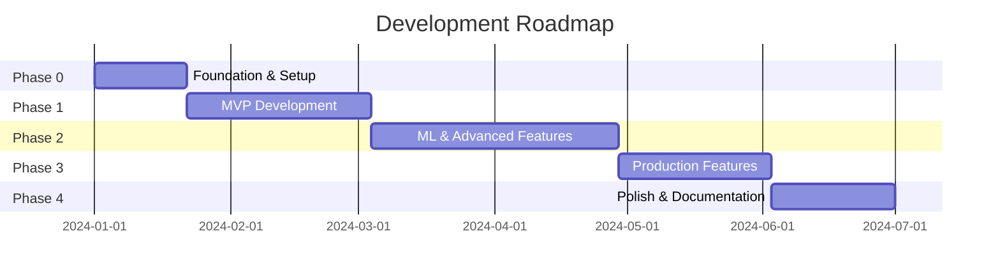

# Strategy Backtester - Product Requirements Document v4.0
## Final Production Version with Implementation Guide

---

## Executive Summary

This is the final production-ready PRD for a high-performance strategy backtesting system. Based on critical reviews and architectural refinements, this version provides:
- **Clear MVP scope** deliverable in 9 weeks
- **Realistic timeline** of 26 weeks for full system
- **Concrete implementation** with actual project structure
- **Engine-specific strategies** without false abstraction promises
- **Progressive enhancement** from simple to sophisticated

### Key Design Decisions
1. **Vectorbt-first approach** - Start with speed, add complexity later
2. **No false abstractions** - Strategies are engine-specific
3. **Quality gates** - Mandatory checkpoints between phases
4. **MVP in 9 weeks** - Working system early, enhance iteratively

---

## Table of Contents
1. [System Architecture](#1-system-architecture)
2. [Project Structure](#2-project-structure)
3. [Functional Requirements](#3-functional-requirements)
4. [Development Roadmap](#4-development-roadmap)
5. [Technical Specifications](#5-technical-specifications)
6. [Implementation Details](#6-implementation-details)
7. [Testing Strategy](#7-testing-strategy)
8. [Risk Management](#8-risk-management)
9. [Success Metrics](#9-success-metrics)
10. [Appendices](#10-appendices)
    - [A: Data Pipeline Implementation](#appendix-a-data-pipeline-implementation)
    - [B: MVP Implementation Plan](#appendix-b-mvp-implementation-plan)
    - [C: Harness Pattern Code](#appendix-c-harness-pattern-code)
    - [D: Installation & Setup](#appendix-d-installation-setup)

---

## 1. System Architecture

### 1.1 High-Level Architecture (Revised)

```
┌─────────────────────────────────────────────────────────────┐
│                         USER INTERFACE                        │
│                    CLI → Web API → Dashboard                  │
└─────────────────────────────────────────────────────────────┘
                                │
┌─────────────────────────────────────────────────────────────┐
│                      ORCHESTRATION LAYER                      │
│   ┌────────────┐  ┌────────────┐  ┌────────────┐           │
│   │  Pipeline  │  │   Config   │  │  Session   │           │
│   │  Manager   │  │   Manager  │  │  Manager   │           │
│   └────────────┘  └────────────┘  └────────────┘           │
└─────────────────────────────────────────────────────────────┘
                                │
┌─────────────────────────────────────────────────────────────┐
│                      STRATEGY LAYER                           │
│   ┌────────────────────┐  ┌────────────────────┐           │
│   │ Vectorbt Strategies│  │   ML Strategies    │           │
│   │  (Speed Focus)     │  │  (Research Focus)  │           │
│   └────────────────────┘  └────────────────────┘           │
└─────────────────────────────────────────────────────────────┘
                                │
┌─────────────────────────────────────────────────────────────┐
│                     BACKTESTING ENGINE                        │
│   ┌──────────┐  ┌──────────┐  ┌──────────┐  ┌──────────┐  │
│   │ Vectorbt │  │Portfolio │  │   Risk   │  │Validation│  │
│   │  Engine  │  │ Manager  │  │  Manager │  │  Suite   │  │
│   └──────────┘  └──────────┘  └──────────┘  └──────────┘  │
└─────────────────────────────────────────────────────────────┘
                                │
┌─────────────────────────────────────────────────────────────┐
│                        DATA LAYER                             │
│   ┌──────────┐  ┌──────────┐  ┌──────────┐  ┌──────────┐  │
│   │   Data   │  │  Quality │  │  Feature │  │   Cache  │  │
│   │ Providers│  │  Scorer  │  │   Store  │  │  Manager │  │
│   └──────────┘  └──────────┘  └──────────┘  └──────────┘  │
└─────────────────────────────────────────────────────────────┘
```

### 1.2 Core Design Principles

1. **Engine Specificity**: Strategies are written for specific engines, not portable
2. **Progressive Enhancement**: Start simple (MVP), add complexity iteratively
3. **Quality First**: Data quality and validation are not optional
4. **Performance Focused**: Vectorized operations, async I/O, efficient caching
5. **Production Ready**: Monitoring, logging, error recovery from day one

---

## 2. Project Structure

### 2.1 Complete Project Layout

```
quantum-backtest/
├── src/
│   └── quantum_backtest/
│       ├── __init__.py
│       ├── __version__.py
│       │
│       ├── core/                    # Core functionality
│       │   ├── __init__.py
│       │   ├── base.py             # Base classes and protocols
│       │   ├── types.py            # Type definitions
│       │   ├── exceptions.py       # Custom exceptions
│       │   └── constants.py        # System constants
│       │
│       ├── data/                    # Data management
│       │   ├── __init__.py
│       │   ├── providers/          # Data source integrations
│       │   │   ├── __init__.py
│       │   │   ├── base.py
│       │   │   ├── yahoo.py       # Yahoo Finance provider
│       │   │   ├── ccxt_provider.py  # Crypto exchanges
│       │   │   └── csv_provider.py   # Local files
│       │   ├── quality/            # Data quality framework
│       │   │   ├── __init__.py
│       │   │   ├── scorer.py      # Quality scoring
│       │   │   ├── validator.py   # Validation rules
│       │   │   └── cleaner.py     # Data cleaning
│       │   ├── cache/              # Caching layer
│       │   │   ├── __init__.py
│       │   │   ├── manager.py
│       │   │   └── storage.py
│       │   └── features/           # Feature engineering
│       │       ├── __init__.py
│       │       ├── store.py       # Feature store (v1: files)
│       │       ├── engineering.py # Feature creation
│       │       └── indicators.py  # Technical indicators
│       │
│       ├── strategies/              # Trading strategies
│       │   ├── __init__.py
│       │   ├── base.py            # Base strategy classes
│       │   ├── vectorbt/          # Vectorbt-specific strategies
│       │   │   ├── __init__.py
│       │   │   ├── ma_cross.py
│       │   │   ├── rsi_mean_reversion.py
│       │   │   ├── breakout.py
│       │   │   └── ml_strategy.py
│       │   ├── validation/        # Strategy validation
│       │   │   ├── __init__.py
│       │   │   ├── overfit.py    # Overfitting prevention
│       │   │   ├── stability.py  # Parameter stability
│       │   │   └── walk_forward.py
│       │   └── optimization/      # Parameter optimization
│       │       ├── __init__.py
│       │       ├── grid_search.py
│       │       └── bayesian.py   # Future
│       │
│       ├── engine/                  # Backtesting engine
│       │   ├── __init__.py
│       │   ├── harness.py         # Engine harness
│       │   ├── vectorbt_engine.py # Vectorbt implementation
│       │   ├── portfolio.py       # Portfolio management
│       │   ├── risk.py           # Risk management
│       │   └── execution.py      # Order execution simulation
│       │
│       ├── analysis/                # Analysis and reporting
│       │   ├── __init__.py
│       │   ├── metrics.py         # Performance metrics
│       │   ├── statistics.py      # Statistical analysis
│       │   ├── visualization.py   # Charts and plots
│       │   └── reports.py        # Report generation
│       │
│       ├── api/                     # REST API (Phase 3)
│       │   ├── __init__.py
│       │   ├── app.py            # FastAPI application
│       │   ├── routes/
│       │   │   ├── __init__.py
│       │   │   ├── backtest.py
│       │   │   ├── data.py
│       │   │   └── strategies.py
│       │   └── schemas/          # Pydantic models
│       │       ├── __init__.py
│       │       └── models.py
│       │
│       ├── utils/                   # Utilities
│       │   ├── __init__.py
│       │   ├── logging.py        # Structured logging
│       │   ├── config.py         # Configuration management
│       │   ├── decorators.py     # Useful decorators
│       │   └── async_utils.py    # Async helpers
│       │
│       └── cli/                     # Command-line interface
│           ├── __init__.py
│           └── main.py           # Click CLI
│
├── tests/                           # Test suite
│   ├── __init__.py
│   ├── conftest.py               # Pytest configuration
│   ├── unit/                     # Unit tests
│   │   ├── __init__.py
│   │   ├── test_data/
│   │   ├── test_strategies/
│   │   └── test_engine/
│   ├── integration/              # Integration tests
│   │   ├── __init__.py
│   │   └── test_pipeline.py
│   ├── performance/              # Performance benchmarks
│   │   ├── __init__.py
│   │   └── benchmarks.py
│   └── fixtures/                 # Test data
│       ├── sample_data.csv
│       └── test_config.yaml
│
├── configs/                         # Configuration files
│   ├── default.yaml              # Default configuration
│   ├── strategies/               # Strategy configurations
│   │   ├── ma_cross.yaml
│   │   └── ml_strategy.yaml
│   └── environments/             # Environment configs
│       ├── development.yaml
│       ├── testing.yaml
│       └── production.yaml
│
├── notebooks/                       # Jupyter notebooks
│   ├── 01_data_exploration.ipynb
│   ├── 02_strategy_development.ipynb
│   ├── 03_ml_features.ipynb
│   └── 04_results_analysis.ipynb
│
├── scripts/                         # Utility scripts
│   ├── setup_environment.py      # Initial setup
│   ├── download_sample_data.py   # Get sample data
│   ├── run_backtest.py          # Quick backtest script
│   └── validate_installation.py  # Check installation
│
├── docs/                            # Documentation
│   ├── index.md
│   ├── getting_started.md
│   ├── user_guide/
│   │   ├── installation.md
│   │   ├── configuration.md
│   │   ├── strategies.md
│   │   └── analysis.md
│   ├── api_reference/
│   │   └── modules.md
│   └── development/
│       ├── contributing.md
│       └── architecture.md
│
├── docker/                          # Docker configuration
│   ├── Dockerfile
│   ├── docker-compose.yml
│   └── .dockerignore
│
├── .github/                         # GitHub configuration
│   ├── workflows/
│   │   ├── ci.yml               # Continuous integration
│   │   ├── tests.yml            # Test workflow
│   │   └── release.yml          # Release workflow
│   └── ISSUE_TEMPLATE/
│       ├── bug_report.md
│       └── feature_request.md
│
├── pyproject.toml                   # Modern Python project config
├── setup.py                         # Backwards compatibility
├── requirements.txt                 # Production dependencies
├── requirements-dev.txt             # Development dependencies
├── Makefile                         # Common commands
├── .env.example                     # Environment variables template
├── .gitignore
├── LICENSE
└── README.md
```

### 2.2 Key File Templates

#### pyproject.toml
```toml
[build-system]
requires = ["setuptools>=64", "wheel"]
build-backend = "setuptools.build_meta"

[project]
name = "quantum-backtest"
version = "0.1.0"
description = "High-performance strategy backtesting system"
readme = "README.md"
requires-python = ">=3.12"
license = {text = "MIT"}
authors = [
    {name = "Your Name", email = "your.email@example.com"}
]
dependencies = [
    "polars>=0.20.3",
    "vectorbt>=0.26.0",
    "pandas>=2.1.4",
    "numpy>=1.26.3",
    "yfinance>=0.2.36",
    "ccxt>=4.2.0",
    "pandas-ta>=0.3.14b",
    "scikit-learn>=1.4.0",
    "plotly>=5.18.0",
    "pydantic>=2.5.3",
    "fastapi>=0.109.0",
    "click>=8.1.7",
    "pyyaml>=6.0.1",
    "structlog>=24.1.0",
    "asyncio>=3.4.3",
    "aiohttp>=3.9.1",
    "redis>=5.0.1",
    "sqlalchemy>=2.0.25"
]

[project.optional-dependencies]
dev = [
    "pytest>=7.4.4",
    "pytest-asyncio>=0.23.3",
    "pytest-cov>=4.1.0",
    "black>=23.12.1",
    "ruff>=0.1.14",
    "mypy>=1.8.0",
    "jupyter>=1.0.0",
    "ipython>=8.19.0"
]
ml = [
    "xgboost>=2.0.3",
    "lightgbm>=4.3.0",
    "optuna>=3.5.0"
]

[project.scripts]
quantum-backtest = "quantum_backtest.cli.main:cli"

[tool.black]
line-length = 88
target-version = ['py312']

[tool.ruff]
select = ["E", "F", "I", "N", "W"]
line-length = 88
target-version = "py312"

[tool.mypy]
python_version = "3.12"
warn_return_any = true
warn_unused_configs = true
disallow_untyped_defs = true

[tool.pytest.ini_options]
testpaths = ["tests"]
python_files = ["test_*.py"]
addopts = "-v --cov=quantum_backtest --cov-report=html"
```

#### Makefile
```makefile
.PHONY: help install install-dev test lint format clean run-backtest docs

help:
	@echo "Available commands:"
	@echo "  install       Install production dependencies"
	@echo "  install-dev   Install development dependencies"
	@echo "  test          Run test suite"
	@echo "  lint          Run linting"
	@echo "  format        Format code"
	@echo "  clean         Clean build artifacts"
	@echo "  run-backtest  Run sample backtest"
	@echo "  docs          Build documentation"

install:
	pip install -e .

install-dev:
	pip install -e ".[dev,ml]"
	pre-commit install

test:
	pytest tests/ -v --cov=quantum_backtest

lint:
	ruff check src/
	mypy src/

format:
	black src/ tests/
	ruff check --fix src/

clean:
	rm -rf build/ dist/ *.egg-info
	find . -type d -name __pycache__ -exec rm -rf {} +
	find . -type f -name "*.pyc" -delete

run-backtest:
	python scripts/run_backtest.py --strategy ma_cross --symbols AAPL,MSFT

docs:
	mkdocs build

docker-build:
	docker build -t quantum-backtest:latest -f docker/Dockerfile .

docker-run:
	docker-compose -f docker/docker-compose.yml up
```

---

## 3. Functional Requirements

### 3.1 MVP Requirements (Weeks 1-9)

| Component | Requirements | Priority |
|-----------|-------------|----------|
| **Data Pipeline** | Yahoo Finance integration, CSV support, Quality scoring | P0 |
| **Backtesting Engine** | Vectorbt integration, Basic portfolio management | P0 |
| **Strategies** | 3 basic strategies (MA Cross, RSI, Breakout) | P0 |
| **Validation** | Walk-forward, Parameter stability | P0 |
| **Reporting** | Markdown reports, Basic visualizations | P0 |
| **Testing** | 80% coverage, Performance benchmarks | P0 |

### 3.2 Full System Requirements (Weeks 10-26)

| Component | Requirements | Priority |
|-----------|-------------|----------|
| **ML Pipeline** | Feature engineering, Purged CV, Model training | P1 |
| **Advanced Validation** | Monte Carlo, Statistical significance | P1 |
| **API** | REST API, WebSocket updates | P2 |
| **Monitoring** | Metrics, Health checks, Alerts | P2 |
| **Additional Engines** | Backtrader support | P3 |
| **Live Trading** | Paper trading connector | P3 |

---

## 4. Development Roadmap

### 4.1 Phase Overview



### 4.2 Detailed Timeline

#### Phase 0: Foundation (Weeks 1-3)
- **Week 1**: Project setup, environment configuration
- **Week 2**: Data pipeline, quality framework
- **Week 3**: Core types, base classes, testing framework

**Deliverable**: Working data pipeline with quality scoring

#### Phase 1: MVP (Weeks 4-9)
- **Week 4-5**: Vectorbt engine integration
- **Week 6-7**: Basic strategies implementation
- **Week 8**: Validation framework
- **Week 9**: Reporting and documentation

**Deliverable**: Complete MVP backtesting system

#### Phase 2: ML & Advanced (Weeks 10-17)
- **Week 10-11**: Feature engineering pipeline
- **Week 12-13**: ML strategy framework
- **Week 14-15**: Purged CV implementation
- **Week 16-17**: Advanced validation

**Deliverable**: ML-capable backtesting platform

#### Phase 3: Production (Weeks 18-22)
- **Week 18-19**: REST API development
- **Week 20-21**: Monitoring and alerting
- **Week 22**: Performance optimization

**Deliverable**: Production-ready system

#### Phase 4: Polish (Weeks 23-26)
- **Week 23-24**: Documentation completion
- **Week 25**: Performance tuning
- **Week 26**: Final testing and release

**Deliverable**: v1.0 Release

---

## 5. Technical Specifications

### 5.1 Core Dependencies

```python
# requirements.txt
# Core
polars==0.20.3              # Data processing
vectorbt==0.26.0            # Backtesting engine
pandas==2.1.4               # Compatibility
numpy==1.26.3               # Numerical operations

# Data Sources
yfinance==0.2.36            # Yahoo Finance
ccxt==4.2.0                 # Crypto exchanges
aiohttp==3.9.1              # Async HTTP

# Analysis
pandas-ta==0.3.14b          # Technical indicators
scikit-learn==1.4.0         # Machine learning
plotly==5.18.0              # Visualizations

# Infrastructure
fastapi==0.109.0            # REST API
pydantic==2.5.3             # Data validation
structlog==24.1.0           # Logging
redis==5.0.1                # Caching

# Development
pytest==7.4.4               # Testing
black==23.12.1              # Formatting
mypy==1.8.0                 # Type checking
```

### 5.2 Configuration Schema

```yaml
# configs/default.yaml
system:
  log_level: INFO
  cache_enabled: true
  max_workers: 4

data:
  provider: yahoo
  cache_dir: ~/.quantum_backtest/cache
  quality:
    min_score: 0.7
    enforcement: warn  # warn | block | fix
    
backtest:
  initial_cash: 100000
  commission: 0.001
  slippage: 0.001
  
validation:
  walk_forward:
    windows: 5
    train_ratio: 0.7
  parameter_stability:
    sensitivity_threshold: 0.2
    min_stability_score: 0.7
    
reporting:
  output_dir: ./results
  formats: [markdown, html]
  include_charts: true
```

---

## 6. Implementation Details

### 6.1 Data Quality Framework

```python
from enum import Enum
from dataclasses import dataclass
import polars as pl

class QualityCheck(Enum):
    COMPLETENESS = "completeness"
    CONSISTENCY = "consistency"
    VALIDITY = "validity"
    TIMELINESS = "timeliness"

@dataclass
class QualityScore:
    overall: float
    details: dict[QualityCheck, float]
    issues: list[str]
    
class DataQualityScorer:
    def score(self, df: pl.DataFrame) -> QualityScore:
        scores = {}
        issues = []
        
        # Completeness
        null_ratio = df.null_count().sum() / (len(df) * len(df.columns))
        scores[QualityCheck.COMPLETENESS] = 1 - null_ratio
        
        # Consistency
        ohlc_valid = (
            (df['high'] >= df['low']).all() &
            (df['high'] >= df['open']).all() &
            (df['close'] >= df['low']).all()
        )
        scores[QualityCheck.CONSISTENCY] = float(ohlc_valid)
        
        # Overall
        overall = sum(scores.values()) / len(scores)
        
        return QualityScore(overall, scores, issues)
```

### 6.2 Engine Harness Pattern

```python
from abc import ABC, abstractmethod
import vectorbt as vbt

class StrategyResult:
    """Unified result interface"""
    def __init__(self, metrics: dict, trades: list, equity_curve: list):
        self.metrics = metrics
        self.trades = trades
        self.equity_curve = equity_curve

class VectorbtStrategy(ABC):
    """Base for vectorized strategies"""
    @abstractmethod
    def generate_signals(self, data: pl.DataFrame) -> tuple:
        """Return (entries, exits) as boolean arrays"""
        pass

class EngineHarness:
    """Runs strategies and returns unified results"""
    
    def run_backtest(self, 
                    strategy: VectorbtStrategy,
                    data: pl.DataFrame,
                    config: dict) -> StrategyResult:
        
        # Generate signals
        entries, exits = strategy.generate_signals(data)
        
        # Run vectorbt backtest
        portfolio = vbt.Portfolio.from_signals(
            data['close'].to_numpy(),
            entries,
            exits,
            init_cash=config['initial_cash'],
            fees=config['commission'],
            slippage=config['slippage']
        )
        
        # Extract unified results
        return StrategyResult(
            metrics={
                'total_return': portfolio.total_return(),
                'sharpe_ratio': portfolio.sharpe_ratio(),
                'max_drawdown': portfolio.max_drawdown()
            },
            trades=portfolio.trades.records,
            equity_curve=portfolio.value().to_list()
        )
```

---

## 7. Testing Strategy

### 7.1 Test Coverage Requirements

| Phase | Unit Tests | Integration | Performance | Statistical |
|-------|------------|-------------|-------------|-------------|
| MVP (Week 9) | 80% | Core pipeline | < 1s for daily | Basic validation |
| ML (Week 17) | 85% | Full pipeline | < 5s for ML | Purged CV |
| Production (Week 22) | 90% | API + Engine | < 100ms API | Full suite |

### 7.2 Test Examples

```python
# tests/unit/test_data/test_quality.py
import pytest
import polars as pl
from quantum_backtest.data.quality import DataQualityScorer

def test_quality_scorer_perfect_data():
    df = pl.DataFrame({
        'open': [100, 101, 102],
        'high': [105, 106, 107],
        'low': [99, 100, 101],
        'close': [104, 105, 106],
        'volume': [1000, 1100, 1200]
    })
    
    scorer = DataQualityScorer()
    score = scorer.score(df)
    
    assert score.overall > 0.9
    assert len(score.issues) == 0

def test_quality_scorer_invalid_ohlc():
    df = pl.DataFrame({
        'open': [100, 101, 102],
        'high': [105, 106, 107],
        'low': [110, 111, 112],  # Invalid: low > high
        'close': [104, 105, 106],
        'volume': [1000, 1100, 1200]
    })
    
    scorer = DataQualityScorer()
    score = scorer.score(df)
    
    assert score.overall < 0.5
    assert 'OHLC consistency' in str(score.issues)
```

---

## 8. Risk Management

### 8.1 Technical Risks

| Risk | Mitigation | Monitor |
|------|------------|---------|
| Performance bottlenecks | Profile early, optimize critical paths | Weekly benchmarks |
| Data quality issues | Quality gates, multiple sources | Daily quality reports |
| Overfitting | Purged CV, walk-forward mandatory | Every strategy test |
| Technical debt | Debt tracker, refactoring sprints | Sprint reviews |

### 8.2 Project Risks

| Risk | Mitigation | Monitor |
|------|------------|---------|
| Scope creep | Strict phase gates, MVP focus | Weekly status |
| Timeline slippage | Buffer time, parallel work streams | Daily standups |
| Dependency issues | Pin versions, regular updates | CI/CD pipeline |

---

## 9. Success Metrics

### 9.1 System Performance

| Metric | Target | Measurement |
|--------|--------|-------------|
| Backtest speed (simple) | < 0.5s / year | Benchmark suite |
| Backtest speed (ML) | < 5s / year | Benchmark suite |
| Memory usage | < 1GB / million rows | Memory profiler |
| API latency (p99) | < 100ms | Monitoring |

### 9.2 Quality Metrics

| Metric | Target | Measurement |
|--------|--------|-------------|
| Test coverage | > 90% | pytest-cov |
| Type coverage | 100% | mypy |
| Documentation | 100% public APIs | docstring coverage |
| Code quality | A rating | SonarQube |

---

## 10. Appendices

## Appendix A: Data Pipeline Implementation

### A.1 Complete Data Pipeline Code

```python
# src/quantum_backtest/data/providers/yahoo.py
import polars as pl
import yfinance as yf
from datetime import datetime
from typing import Optional
import asyncio
from ..quality.scorer import DataQualityScorer

class YahooDataProvider:
    """Yahoo Finance data provider with quality checks"""
    
    def __init__(self, cache_dir: Optional[str] = None):
        self.cache_dir = cache_dir
        self.quality_scorer = DataQualityScorer()
        
    async def fetch_data(self, 
                        symbol: str,
                        start: datetime,
                        end: datetime,
                        interval: str = '1d') -> pl.DataFrame:
        """Fetch and validate data from Yahoo Finance"""
        
        # Check cache first
        cache_key = f"{symbol}_{start}_{end}_{interval}"
        if cached := self._check_cache(cache_key):
            return cached
            
        # Fetch from Yahoo
        ticker = yf.Ticker(symbol)
        df_pandas = ticker.history(
            start=start,
            end=end,
            interval=interval
        )
        
        # Convert to Polars
        df = pl.from_pandas(df_pandas.reset_index())
        
        # Standardize columns
        df = df.rename({
            'Date': 'timestamp',
            'Open': 'open',
            'High': 'high',
            'Low': 'low',
            'Close': 'close',
            'Volume': 'volume'
        })
        
        # Add derived columns
        df = df.with_columns([
            pl.col('close').pct_change().alias('returns'),
            ((pl.col('high') - pl.col('low')) / pl.col('close')).alias('volatility')
        ])
        
        # Quality check
        quality = self.quality_scorer.score(df)
        if quality.overall < 0.7:
            self._handle_quality_issues(df, quality)
            
        # Cache the data
        self._save_cache(cache_key, df)
        
        return df
    
    def _handle_quality_issues(self, df: pl.DataFrame, quality):
        """Handle data quality issues"""
        if quality.details[QualityCheck.COMPLETENESS] < 0.9:
            # Forward fill missing values
            df = df.fill_null(strategy='forward')
            
        if quality.details[QualityCheck.CONSISTENCY] < 1.0:
            # Fix OHLC violations
            df = df.with_columns([
                pl.when(pl.col('high') < pl.col('low'))
                  .then(pl.col('low'))
                  .otherwise(pl.col('high'))
                  .alias('high')
            ])

# src/quantum_backtest/data/quality/scorer.py
import polars as pl
import numpy as np
from dataclasses import dataclass
from enum import Enum
from typing import Dict, List

class QualityCheck(Enum):
    COMPLETENESS = "completeness"
    CONSISTENCY = "consistency"
    VALIDITY = "validity"
    TIMELINESS = "timeliness"
    UNIQUENESS = "uniqueness"

@dataclass
class QualityReport:
    overall_score: float
    check_scores: Dict[QualityCheck, float]
    issues: List[str]
    recommendations: List[str]

class DataQualityScorer:
    """Comprehensive data quality scoring system"""
    
    def __init__(self, config: dict = None):
        self.config = config or {}
        self.thresholds = {
            QualityCheck.COMPLETENESS: 0.95,
            QualityCheck.CONSISTENCY: 1.0,
            QualityCheck.VALIDITY: 0.99,
            QualityCheck.TIMELINESS: 0.9,
            QualityCheck.UNIQUENESS: 1.0
        }
    
    def score(self, df: pl.DataFrame) -> QualityReport:
        """Score data quality across multiple dimensions"""
        scores = {}
        issues = []
        recommendations = []
        
        # 1. Completeness Check
        null_count = df.null_count().sum()
        total_cells = len(df) * len(df.columns)
        completeness = 1 - (null_count / total_cells) if total_cells > 0 else 0
        scores[QualityCheck.COMPLETENESS] = completeness
        
        if completeness < self.thresholds[QualityCheck.COMPLETENESS]:
            issues.append(f"Missing data: {null_count} null values found")
            recommendations.append("Consider forward-filling or interpolation")
        
        # 2. Consistency Check (OHLC relationships)
        if all(col in df.columns for col in ['open', 'high', 'low', 'close']):
            consistency_checks = [
                (df['high'] >= df['low']).all(),
                (df['high'] >= df['open']).all(),
                (df['high'] >= df['close']).all(),
                (df['low'] <= df['open']).all(),
                (df['low'] <= df['close']).all()
            ]
            consistency = sum(consistency_checks) / len(consistency_checks)
            scores[QualityCheck.CONSISTENCY] = consistency
            
            if consistency < 1.0:
                issues.append("OHLC consistency violations detected")
                recommendations.append("Review and fix OHLC relationships")
        
        # 3. Validity Check (outliers)
        if 'returns' in df.columns:
            returns = df['returns'].drop_nulls()
            if len(returns) > 0:
                mean = returns.mean()
                std = returns.std()
                outliers = ((returns - mean).abs() > 5 * std).sum()
                validity = 1 - (outliers / len(returns))
                scores[QualityCheck.VALIDITY] = validity
                
                if validity < self.thresholds[QualityCheck.VALIDITY]:
                    issues.append(f"Outliers detected: {outliers} extreme returns")
                    recommendations.append("Consider outlier removal or capping")
        
        # 4. Timeliness Check (data gaps)
        if 'timestamp' in df.columns:
            timestamps = df['timestamp'].sort()
            gaps = timestamps.diff()
            expected_gap = gaps.mode()[0]  # Most common gap
            irregular_gaps = (gaps != expected_gap).sum()
            timeliness = 1 - (irregular_gaps / len(gaps))
            scores[QualityCheck.TIMELINESS] = timeliness
            
            if timeliness < self.thresholds[QualityCheck.TIMELINESS]:
                issues.append(f"Time gaps detected: {irregular_gaps} irregular intervals")
                recommendations.append("Check for missing dates/trading halts")
        
        # 5. Uniqueness Check (duplicates)
        duplicate_count = df.is_duplicated().sum()
        uniqueness = 1 - (duplicate_count / len(df)) if len(df) > 0 else 1
        scores[QualityCheck.UNIQUENESS] = uniqueness
        
        if uniqueness < 1.0:
            issues.append(f"Duplicates found: {duplicate_count} duplicate rows")
            recommendations.append("Remove duplicate entries")
        
        # Calculate overall score
        overall_score = np.mean(list(scores.values()))
        
        return QualityReport(
            overall_score=overall_score,
            check_scores=scores,
            issues=issues,
            recommendations=recommendations
        )
    
    def generate_report_markdown(self, report: QualityReport) -> str:
        """Generate markdown report from quality assessment"""
        md = f"""# Data Quality Report

## Overall Score: {report.overall_score:.2%}

## Individual Checks:
"""
        for check, score in report.check_scores.items():
            status = "✅" if score >= self.thresholds[check] else "⚠️"
            md += f"- {check.value}: {score:.2%} {status}\n"
        
        if report.issues:
            md += "\n## Issues Found:\n"
            for issue in report.issues:
                md += f"- {issue}\n"
        
        if report.recommendations:
            md += "\n## Recommendations:\n"
            for rec in report.recommendations:
                md += f"- {rec}\n"
                
        return md
```

---

## Appendix B: MVP Implementation Plan

### B.1 Week-by-Week MVP Development

#### Week 1-3: Foundation
```python
# Week 1: Project Setup
tasks_week_1 = [
    "Initialize git repository",
    "Set up Python 3.12 environment",
    "Create project structure",
    "Install core dependencies",
    "Set up testing framework",
    "Configure logging"
]

# Week 2: Data Pipeline
tasks_week_2 = [
    "Implement YahooDataProvider",
    "Create DataQualityScorer",
    "Build caching layer",
    "Add CSV data loader",
    "Write data pipeline tests"
]

# Week 3: Core Framework
tasks_week_3 = [
    "Define base classes",
    "Create type definitions",
    "Build configuration system",
    "Implement error handling",
    "Set up CI/CD pipeline"
]
```

#### Week 4-6: Backtesting Engine
```python
# src/quantum_backtest/engine/vectorbt_engine.py
import vectorbt as vbt
import polars as pl
import numpy as np
from typing import Tuple, Dict, Any
from ..strategies.base import VectorbtStrategy

class VectorbtEngine:
    """Vectorbt backtesting engine"""
    
    def __init__(self, config: Dict[str, Any]):
        self.config = config
        self.init_cash = config.get('initial_cash', 100000)
        self.fees = config.get('commission', 0.001)
        self.slippage = config.get('slippage', 0.001)
        
    def run_backtest(self,
                    strategy: VectorbtStrategy,
                    data: pl.DataFrame) -> BacktestResult:
        """Execute backtest with given strategy and data"""
        
        # Prepare data
        close_prices = data['close'].to_numpy()
        
        # Generate signals
        entries, exits = strategy.generate_signals(data)
        
        # Run vectorbt portfolio simulation
        portfolio = vbt.Portfolio.from_signals(
            close_prices,
            entries,
            exits,
            init_cash=self.init_cash,
            fees=self.fees,
            slippage=self.slippage,
            freq='1d'
        )
        
        # Calculate metrics
        metrics = self._calculate_metrics(portfolio)
        
        # Extract trades
        trades = self._extract_trades(portfolio)
        
        # Get equity curve
        equity_curve = portfolio.value().to_numpy()
        
        return BacktestResult(
            metrics=metrics,
            trades=trades,
            equity_curve=equity_curve,
            portfolio=portfolio
        )
    
    def _calculate_metrics(self, portfolio) -> Dict[str, float]:
        """Calculate performance metrics"""
        return {
            'total_return': portfolio.total_return(),
            'annual_return': portfolio.annualized_return(),
            'sharpe_ratio': portfolio.sharpe_ratio(),
            'sortino_ratio': portfolio.sortino_ratio(),
            'calmar_ratio': portfolio.calmar_ratio(),
            'max_drawdown': portfolio.max_drawdown(),
            'win_rate': portfolio.trades.win_rate(),
            'profit_factor': portfolio.trades.profit_factor(),
            'expectancy': portfolio.trades.expectancy(),
            'total_trades': portfolio.trades.count()
        }
```

#### Week 7-9: Strategies & Validation
```python
# src/quantum_backtest/strategies/vectorbt/ma_cross.py
import polars as pl
import numpy as np
from typing import Tuple
from ..base import VectorbtStrategy

class MovingAverageCrossStrategy(VectorbtStrategy):
    """Classic moving average crossover strategy"""
    
    def __init__(self, fast_period: int = 20, slow_period: int = 50):
        self.fast_period = fast_period
        self.slow_period = slow_period
        
    def generate_signals(self, data: pl.DataFrame) -> Tuple[np.ndarray, np.ndarray]:
        """Generate entry and exit signals"""
        
        # Calculate moving averages
        close_prices = data['close'].to_numpy()
        fast_ma = self._sma(close_prices, self.fast_period)
        slow_ma = self._sma(close_prices, self.slow_period)
        
        # Generate crossover signals
        # Entry: fast MA crosses above slow MA
        entries = (fast_ma > slow_ma) & np.roll(fast_ma <= slow_ma, 1)
        entries[0] = False  # No signal on first bar
        
        # Exit: fast MA crosses below slow MA
        exits = (fast_ma < slow_ma) & np.roll(fast_ma >= slow_ma, 1)
        exits[0] = False
        
        return entries, exits
    
    def _sma(self, prices: np.ndarray, period: int) -> np.ndarray:
        """Calculate simple moving average"""
        sma = np.full_like(prices, np.nan)
        for i in range(period - 1, len(prices)):
            sma[i] = prices[i - period + 1:i + 1].mean()
        return sma
    
    def get_parameters(self) -> Dict[str, Any]:
        """Return strategy parameters"""
        return {
            'fast_period': self.fast_period,
            'slow_period': self.slow_period
        }

# src/quantum_backtest/strategies/validation/walk_forward.py
import polars as pl
import numpy as np
from typing import List, Tuple, Dict, Any
from dataclasses import dataclass

@dataclass
class WalkForwardResult:
    in_sample_results: List[Dict[str, float]]
    out_sample_results: List[Dict[str, float]]
    best_params: List[Dict[str, Any]]
    overall_sharpe: float
    consistency_score: float

class WalkForwardValidator:
    """Walk-forward analysis for strategy validation"""
    
    def __init__(self, 
                 n_windows: int = 5,
                 train_ratio: float = 0.7):
        self.n_windows = n_windows
        self.train_ratio = train_ratio
        
    def validate(self,
                strategy_class,
                param_grid: Dict[str, List],
                data: pl.DataFrame,
                engine) -> WalkForwardResult:
        """Perform walk-forward validation"""
        
        # Split data into windows
        windows = self._create_windows(data)
        
        in_sample_results = []
        out_sample_results = []
        best_params_list = []
        
        for train_data, test_data in windows:
            # Optimize on training data
            best_params, is_result = self._optimize_parameters(
                strategy_class, param_grid, train_data, engine
            )
            
            # Test on out-of-sample data
            strategy = strategy_class(**best_params)
            oos_result = engine.run_backtest(strategy, test_data)
            
            in_sample_results.append(is_result.metrics)
            out_sample_results.append(oos_result.metrics)
            best_params_list.append(best_params)
        
        # Calculate overall metrics
        overall_sharpe = np.mean([r['sharpe_ratio'] for r in out_sample_results])
        consistency = 1 - np.std([r['sharpe_ratio'] for r in out_sample_results])
        
        return WalkForwardResult(
            in_sample_results=in_sample_results,
            out_sample_results=out_sample_results,
            best_params=best_params_list,
            overall_sharpe=overall_sharpe,
            consistency_score=consistency
        )
    
    def _create_windows(self, data: pl.DataFrame) -> List[Tuple]:
        """Create train/test windows for walk-forward"""
        total_rows = len(data)
        window_size = total_rows // self.n_windows
        
        windows = []
        for i in range(self.n_windows):
            start_idx = i * window_size
            end_idx = min((i + 1) * window_size, total_rows)
            
            split_idx = start_idx + int((end_idx - start_idx) * self.train_ratio)
            
            train_data = data[start_idx:split_idx]
            test_data = data[split_idx:end_idx]
            
            windows.append((train_data, test_data))
            
        return windows
```

### B.2 MVP Testing Framework

```python
# tests/integration/test_mvp_pipeline.py
import pytest
import polars as pl
from datetime import datetime, timedelta
from quantum_backtest.data.providers import YahooDataProvider
from quantum_backtest.engine import VectorbtEngine
from quantum_backtest.strategies.vectorbt import MovingAverageCrossStrategy
from quantum_backtest.strategies.validation import WalkForwardValidator

@pytest.fixture
async def sample_data():
    """Fetch sample data for testing"""
    provider = YahooDataProvider()
    data = await provider.fetch_data(
        symbol="SPY",
        start=datetime.now() - timedelta(days=365*2),
        end=datetime.now()
    )
    return data

@pytest.mark.asyncio
async def test_mvp_pipeline(sample_data):
    """Test complete MVP pipeline"""
    
    # 1. Data quality check
    assert sample_data.quality_score > 0.7
    
    # 2. Initialize engine
    config = {
        'initial_cash': 100000,
        'commission': 0.001,
        'slippage': 0.001
    }
    engine = VectorbtEngine(config)
    
    # 3. Create and run strategy
    strategy = MovingAverageCrossStrategy(fast_period=20, slow_period=50)
    result = engine.run_backtest(strategy, sample_data)
    
    # 4. Validate results
    assert result.metrics['total_trades'] > 0
    assert 'sharpe_ratio' in result.metrics
    assert len(result.equity_curve) == len(sample_data)
    
    # 5. Walk-forward validation
    validator = WalkForwardValidator(n_windows=3)
    wf_result = validator.validate(
        MovingAverageCrossStrategy,
        {'fast_period': [10, 20, 30], 'slow_period': [40, 50, 60]},
        sample_data,
        engine
    )
    
    assert wf_result.overall_sharpe > -1  # Some reasonable threshold
    assert wf_result.consistency_score > 0
```

---

## Appendix C: Harness Pattern Code

### C.1 Complete Engine Harness Implementation

```python
# src/quantum_backtest/engine/harness.py
from abc import ABC, abstractmethod
from typing import Protocol, Dict, Any, List, Union
from dataclasses import dataclass
import polars as pl
import numpy as np
import vectorbt as vbt

# Result Protocol
class BacktestResult(Protocol):
    """Unified result interface for all engines"""
    metrics: Dict[str, float]
    trades: List[Any]
    equity_curve: np.ndarray
    
    @property
    def total_return(self) -> float: ...
    
    @property
    def sharpe_ratio(self) -> float: ...
    
    @property
    def max_drawdown(self) -> float: ...

@dataclass
class StandardBacktestResult:
    """Standard implementation of BacktestResult"""
    metrics: Dict[str, float]
    trades: List[Any]
    equity_curve: np.ndarray
    raw_portfolio: Any = None  # Original portfolio object
    
    @property
    def total_return(self) -> float:
        return self.metrics.get('total_return', 0.0)
    
    @property
    def sharpe_ratio(self) -> float:
        return self.metrics.get('sharpe_ratio', 0.0)
    
    @property
    def max_drawdown(self) -> float:
        return self.metrics.get('max_drawdown', 0.0)

# Strategy Base Classes
class BaseStrategy(ABC):
    """Base class for all strategies"""
    
    @abstractmethod
    def get_parameters(self) -> Dict[str, Any]:
        """Return current strategy parameters"""
        pass
    
    @abstractmethod
    def validate_data(self, data: pl.DataFrame) -> bool:
        """Validate that data meets strategy requirements"""
        pass

class VectorbtStrategy(BaseStrategy):
    """Base class for Vectorbt strategies"""
    
    @abstractmethod
    def generate_signals(self, data: pl.DataFrame) -> tuple[np.ndarray, np.ndarray]:
        """Generate entry and exit signals"""
        pass
    
    def validate_data(self, data: pl.DataFrame) -> bool:
        """Default validation for vectorbt strategies"""
        required_columns = ['open', 'high', 'low', 'close', 'volume']
        return all(col in data.columns for col in required_columns)

# Future: Backtrader strategy base
class BacktraderStrategy(BaseStrategy):
    """Base class for Backtrader strategies (future implementation)"""
    
    @abstractmethod
    def next(self):
        """Called by Backtrader on each bar"""
        pass

# Engine Implementations
class VectorbtEngine:
    """Vectorbt-specific engine implementation"""
    
    def __init__(self, config: Dict[str, Any]):
        self.config = config
        
    def run(self, 
            strategy: VectorbtStrategy, 
            data: pl.DataFrame) -> StandardBacktestResult:
        """Run vectorbt backtest"""
        
        # Validate data
        if not strategy.validate_data(data):
            raise ValueError("Data validation failed for strategy")
        
        # Generate signals
        entries, exits = strategy.generate_signals(data)
        
        # Create portfolio
        portfolio = vbt.Portfolio.from_signals(
            data['close'].to_numpy(),
            entries,
            exits,
            init_cash=self.config.get('initial_cash', 100000),
            fees=self.config.get('commission', 0.001),
            slippage=self.config.get('slippage', 0.001)
        )
        
        # Extract results
        metrics = {
            'total_return': portfolio.total_return(),
            'annual_return': portfolio.annualized_return(),
            'sharpe_ratio': portfolio.sharpe_ratio(),
            'sortino_ratio': portfolio.sortino_ratio(),
            'calmar_ratio': portfolio.calmar_ratio(),
            'max_drawdown': portfolio.max_drawdown(),
            'win_rate': len(portfolio.trades.win_records) / len(portfolio.trades.records) if len(portfolio.trades.records) > 0 else 0,
            'total_trades': len(portfolio.trades.records)
        }
        
        trades = [
            {
                'entry_time': t.entry_idx,
                'exit_time': t.exit_idx,
                'entry_price': t.entry_price,
                'exit_price': t.exit_price,
                'size': t.size,
                'pnl': t.pnl,
                'return': t.return_
            }
            for t in portfolio.trades.records
        ]
        
        equity_curve = portfolio.value().to_numpy()
        
        return StandardBacktestResult(
            metrics=metrics,
            trades=trades,
            equity_curve=equity_curve,
            raw_portfolio=portfolio
        )

# Main Harness
class EngineHarness:
    """
    Main harness that manages different engines.
    This is the unified interface for all backtesting.
    """
    
    def __init__(self, config: Dict[str, Any]):
        self.config = config
        self.engines = {
            'vectorbt': VectorbtEngine(config),
            # Future: 'backtrader': BacktraderEngine(config)
        }
        
    def run_backtest(self,
                    strategy: BaseStrategy,
                    data: pl.DataFrame,
                    engine_name: str = None) -> BacktestResult:
        """
        Run backtest with appropriate engine.
        
        Args:
            strategy: Strategy instance
            data: Market data
            engine_name: Specific engine to use (auto-detect if None)
        """
        
        # Auto-detect engine based on strategy type
        if engine_name is None:
            if isinstance(strategy, VectorbtStrategy):
                engine_name = 'vectorbt'
            # elif isinstance(strategy, BacktraderStrategy):
            #     engine_name = 'backtrader'
            else:
                raise ValueError(f"Unknown strategy type: {type(strategy)}")
        
        # Get appropriate engine
        if engine_name not in self.engines:
            raise ValueError(f"Unknown engine: {engine_name}")
        
        engine = self.engines[engine_name]
        
        # Run backtest
        return engine.run(strategy, data)
    
    def compare_strategies(self,
                          strategies: List[BaseStrategy],
                          data: pl.DataFrame) -> Dict[str, BacktestResult]:
        """Run multiple strategies and return comparative results"""
        
        results = {}
        for strategy in strategies:
            name = strategy.__class__.__name__
            results[name] = self.run_backtest(strategy, data)
            
        return results
    
    def optimize_parameters(self,
                           strategy_class,
                           param_grid: Dict[str, List],
                           data: pl.DataFrame) -> tuple[Dict[str, Any], BacktestResult]:
        """
        Optimize strategy parameters via grid search.
        
        Returns:
            Best parameters and corresponding results
        """
        from itertools import product
        
        best_params = None
        best_result = None
        best_sharpe = -np.inf
        
        # Generate all parameter combinations
        param_names = list(param_grid.keys())
        param_values = [param_grid[name] for name in param_names]
        
        for values in product(*param_values):
            params = dict(zip(param_names, values))
            
            # Create strategy with these parameters
            strategy = strategy_class(**params)
            
            # Run backtest
            result = self.run_backtest(strategy, data)
            
            # Check if this is the best so far
            if result.sharpe_ratio > best_sharpe:
                best_sharpe = result.sharpe_ratio
                best_params = params
                best_result = result
        
        return best_params, best_result

# Usage Example
def example_usage():
    """Example of using the harness pattern"""
    
    # 1. Load data
    data = pl.read_csv("sample_data.csv")
    
    # 2. Configure harness
    config = {
        'initial_cash': 100000,
        'commission': 0.001,
        'slippage': 0.001
    }
    harness = EngineHarness(config)
    
    # 3. Create strategy
    strategy = MovingAverageCrossStrategy(fast_period=20, slow_period=50)
    
    # 4. Run backtest (engine auto-detected)
    result = harness.run_backtest(strategy, data)
    
    print(f"Total Return: {result.total_return:.2%}")
    print(f"Sharpe Ratio: {result.sharpe_ratio:.2f}")
    print(f"Max Drawdown: {result.max_drawdown:.2%}")
    
    # 5. Optimize parameters
    best_params, best_result = harness.optimize_parameters(
        MovingAverageCrossStrategy,
        {'fast_period': [10, 20, 30], 'slow_period': [40, 50, 60]},
        data
    )
    
    print(f"Best Parameters: {best_params}")
    print(f"Best Sharpe: {best_result.sharpe_ratio:.2f}")
```

---

## Appendix D: Installation & Setup

### D.1 Complete Setup Script

```python
#!/usr/bin/env python3
# scripts/setup_environment.py
"""
Complete setup script for Quantum Backtest system
"""

import os
import sys
import subprocess
import platform
from pathlib import Path

def check_python_version():
    """Ensure Python 3.12+"""
    version = sys.version_info
    if version.major < 3 or (version.major == 3 and version.minor < 12):
        print(f"❌ Python 3.12+ required, found {version.major}.{version.minor}")
        sys.exit(1)
    print(f"✅ Python {version.major}.{version.minor} detected")

def create_directories():
    """Create necessary directories"""
    dirs = [
        'data/raw',
        'data/processed',
        'data/cache',
        'results',
        'logs',
        'models'
    ]
    
    for dir_path in dirs:
        Path(dir_path).mkdir(parents=True, exist_ok=True)
    
    print("✅ Directories created")

def install_dependencies():
    """Install all dependencies"""
    print("📦 Installing dependencies...")
    
    # Upgrade pip
    subprocess.run([sys.executable, "-m", "pip", "install", "--upgrade", "pip"])
    
    # Install main dependencies
    subprocess.run([sys.executable, "-m", "pip", "install", "-e", "."])
    
    # Install dev dependencies
    subprocess.run([sys.executable, "-m", "pip", "install", "-e", ".[dev,ml]"])
    
    print("✅ Dependencies installed")

def install_talib():
    """Special handling for TA-Lib installation"""
    system = platform.system()
    
    if system == "Linux":
        print("📊 Installing TA-Lib on Linux...")
        commands = [
            "wget http://prdownloads.sourceforge.net/ta-lib/ta-lib-0.4.0-src.tar.gz",
            "tar -xzf ta-lib-0.4.0-src.tar.gz",
            "cd ta-lib && ./configure --prefix=/usr && make && sudo make install",
            "pip install TA-Lib"
        ]
        for cmd in commands:
            subprocess.run(cmd, shell=True)
            
    elif system == "Darwin":  # macOS
        print("📊 Installing TA-Lib on macOS...")
        subprocess.run(["brew", "install", "ta-lib"])
        subprocess.run([sys.executable, "-m", "pip", "install", "TA-Lib"])
        
    elif system == "Windows":
        print("📊 For Windows, download TA-Lib from:")
        print("https://www.lfd.uci.edu/~gohlke/pythonlibs/#ta-lib")
        print("Then run: pip install <downloaded_file.whl>")
    
    # Alternative: Use pandas-ta instead
    print("ℹ️  Using pandas-ta as alternative to TA-Lib")
    subprocess.run([sys.executable, "-m", "pip", "install", "pandas-ta"])

def download_sample_data():
    """Download sample data for testing"""
    print("📥 Downloading sample data...")
    
    script = """
import yfinance as yf
import pandas as pd
from datetime import datetime, timedelta

symbols = ['SPY', 'AAPL', 'MSFT', 'GOOGL', 'AMZN']
end_date = datetime.now()
start_date = end_date - timedelta(days=365*3)

for symbol in symbols:
    print(f"Downloading {symbol}...")
    data = yf.download(symbol, start=start_date, end=end_date)
    data.to_csv(f'data/raw/{symbol}.csv')

print("✅ Sample data downloaded")
"""
    
    exec(script)

def run_tests():
    """Run initial tests to verify installation"""
    print("🧪 Running verification tests...")
    
    # Test imports
    try:
        import polars
        import vectorbt
        import pandas
        import numpy
        import sklearn
        print("✅ All core imports successful")
    except ImportError as e:
        print(f"❌ Import failed: {e}")
        return False
    
    # Run pytest
    result = subprocess.run([sys.executable, "-m", "pytest", "tests/", "-v", "-x"])
    
    if result.returncode == 0:
        print("✅ All tests passed")
        return True
    else:
        print("⚠️  Some tests failed")
        return False

def create_env_file():
    """Create .env file from template"""
    env_template = """
# Quantum Backtest Environment Variables

# API Keys (Optional)
YAHOO_API_KEY=
ALPHA_VANTAGE_API_KEY=
POLYGON_API_KEY=

# Data Settings
DATA_DIR=./data
CACHE_DIR=./data/cache
RESULTS_DIR=./results

# Backtesting Settings
DEFAULT_INITIAL_CASH=100000
DEFAULT_COMMISSION=0.001
DEFAULT_SLIPPAGE=0.001

# Logging
LOG_LEVEL=INFO
LOG_FILE=./logs/quantum_backtest.log

# Database (Future)
DATABASE_URL=sqlite:///./data/quantum_backtest.db

# Redis Cache (Optional)
REDIS_HOST=localhost
REDIS_PORT=6379
REDIS_DB=0
"""
    
    with open('.env', 'w') as f:
        f.write(env_template)
    
    print("✅ .env file created")

def main():
    """Main setup routine"""
    print("🚀 Quantum Backtest Setup")
    print("=" * 50)
    
    # Check Python version
    check_python_version()
    
    # Create directories
    create_directories()
    
    # Install dependencies
    install_dependencies()
    
    # Special handling for TA-Lib
    # install_talib()  # Commented out - using pandas-ta instead
    
    # Create env file
    create_env_file()
    
    # Download sample data
    try:
        download_sample_data()
    except Exception as e:
        print(f"⚠️  Sample data download failed: {e}")
        print("You can manually download data later")
    
    # Run tests
    test_success = run_tests()
    
    print("\n" + "=" * 