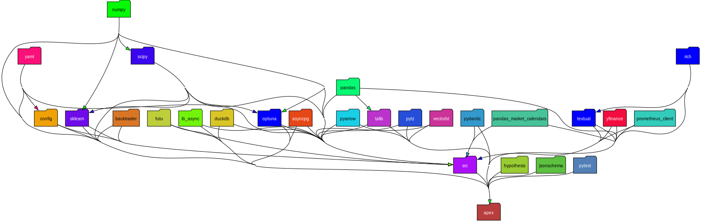
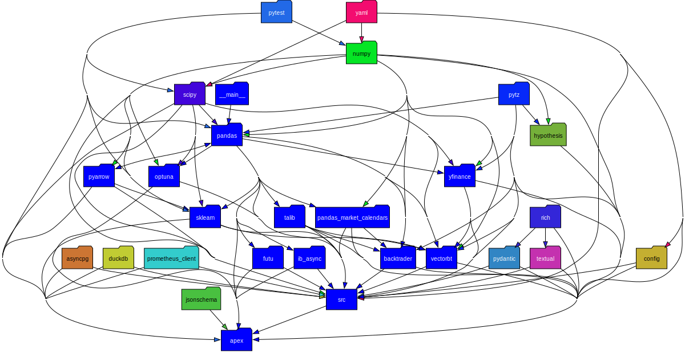
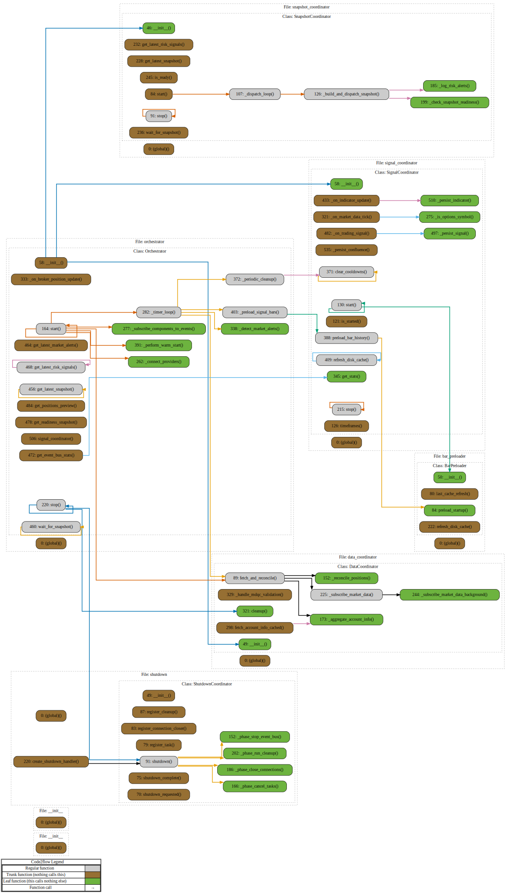
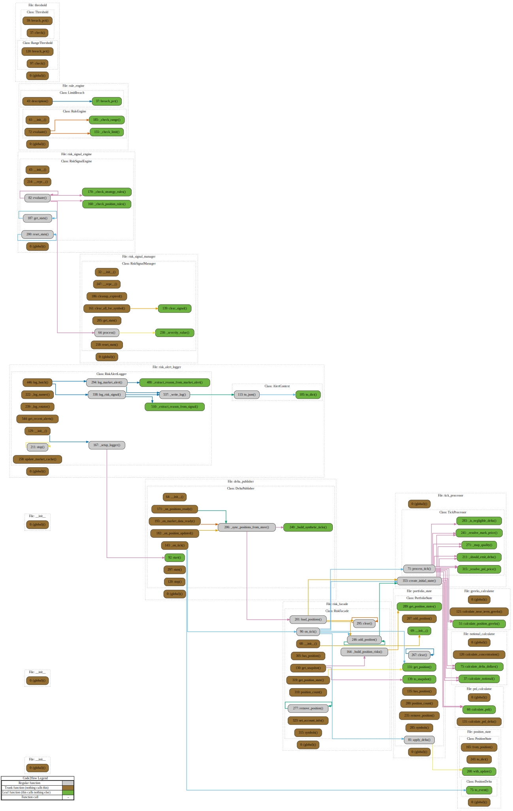
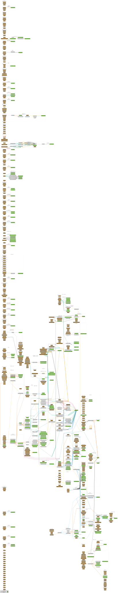

# APEX Architecture Diagrams

Auto-generated architecture diagrams for the APEX risk management system.

## Generation

Diagrams are automatically generated via CI when Python source files change. To generate locally:

```bash
# Install dependencies
uv pip install -e ".[dev]"

# Generate all diagrams
make diagrams

# Or generate specific types
make diagrams-classes  # PlantUML class diagrams
make diagrams-deps     # SVG dependency graphs
make diagrams-flows    # Call flow diagrams (SVG)
```

**Note:** `pydeps` and `code2flow` require Graphviz. Install with:
- macOS: `brew install graphviz`
- Ubuntu: `sudo apt-get install graphviz`

---

## Class Diagrams (PlantUML)

Generated using `pyreverse` from pylint. Each module produces:
- `classes_<name>.puml` - Class relationships, inheritance, and attributes
- `packages_<name>.puml` - Package structure and imports

### Domain Services


### Domain Signals


### Domain Events


### Infrastructure Adapters


### Application Orchestrator


---

## Dependency Graphs (SVG)

These diagrams show module import relationships and package structure.

### Domain Layer Dependencies


### Infrastructure Layer Dependencies


### Full Project Dependencies


---

## Call Flow Diagrams (SVG)

Generated using `code2flow`. These show function call relationships and execution flow within modules.

### Orchestrator Flow


### Risk Services Flow


### Signal Pipeline Flow


---

## Directory Structure

```
docs/diagrams/
├── README.md                              # This file
├── classes/                               # PlantUML class diagrams
│   ├── classes_domain_services.puml
│   ├── packages_domain_services.puml
│   ├── classes_domain_signals.puml
│   ├── packages_domain_signals.puml
│   ├── classes_domain_events.puml
│   ├── packages_domain_events.puml
│   ├── classes_infrastructure_adapters.puml
│   ├── packages_infrastructure_adapters.puml
│   ├── classes_application_orchestrator.puml
│   └── packages_application_orchestrator.puml
├── dependencies/                          # SVG dependency graphs
│   ├── domain_deps.svg
│   ├── infrastructure_deps.svg
│   └── full_project_deps.svg
└── flows/                                 # SVG call flow diagrams
    ├── orchestrator_flow.svg
    ├── risk_services_flow.svg
    └── signal_pipeline_flow.svg
```

---

## Tools Used

| Tool | Purpose | Output |
|------|---------|--------|
| [pyreverse](https://pylint.readthedocs.io/en/latest/pyreverse.html) (pylint) | Class diagrams | PlantUML (.puml) |
| [pydeps](https://github.com/thebjorn/pydeps) | Module dependency graphs | SVG |
| [code2flow](https://github.com/scottrogowski/code2flow) | Call flow diagrams | SVG |

## Rendering

- **PlantUML files**: Rendered via [PlantUML proxy](https://plantuml.com/server) in this README
- **SVG files**: Rendered directly by GitHub
